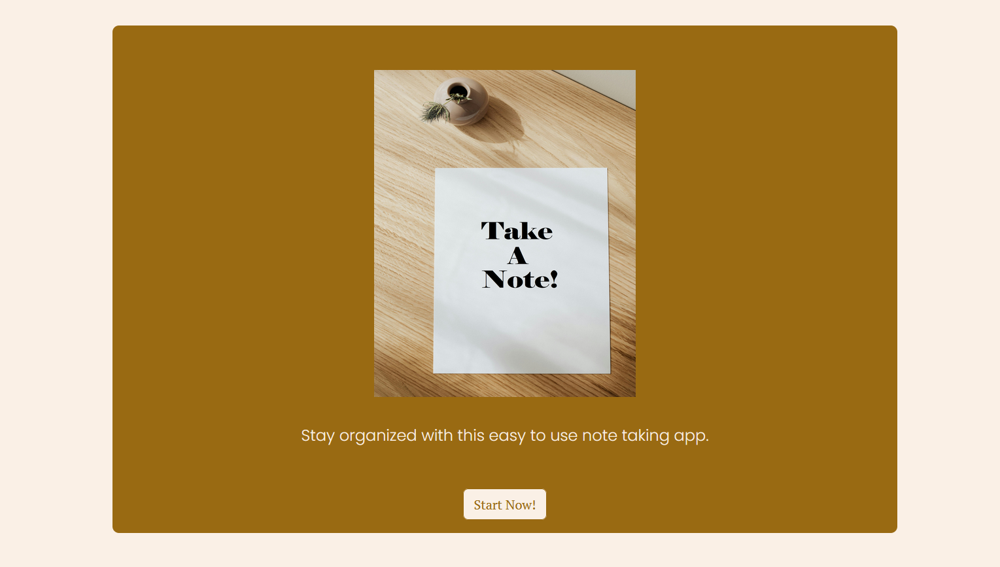
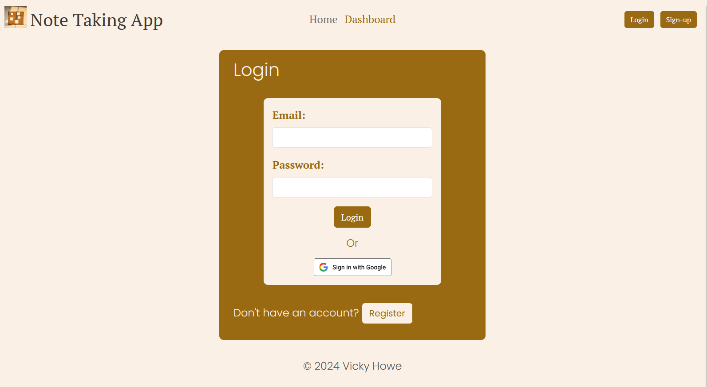
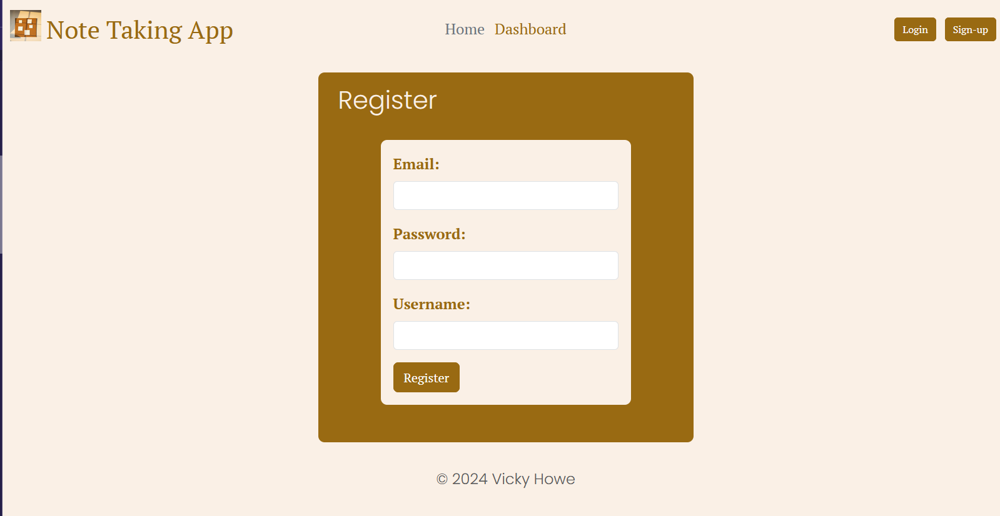
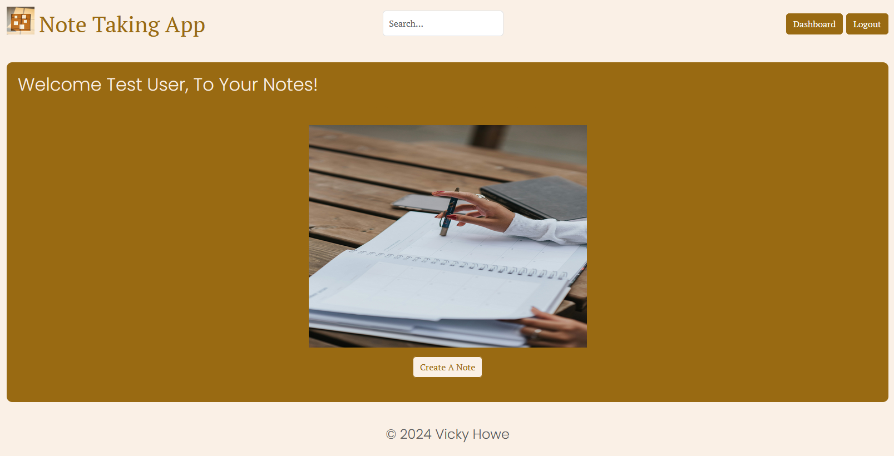
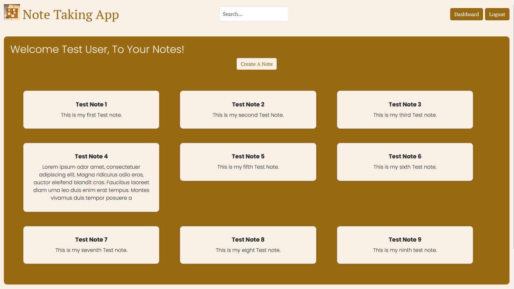
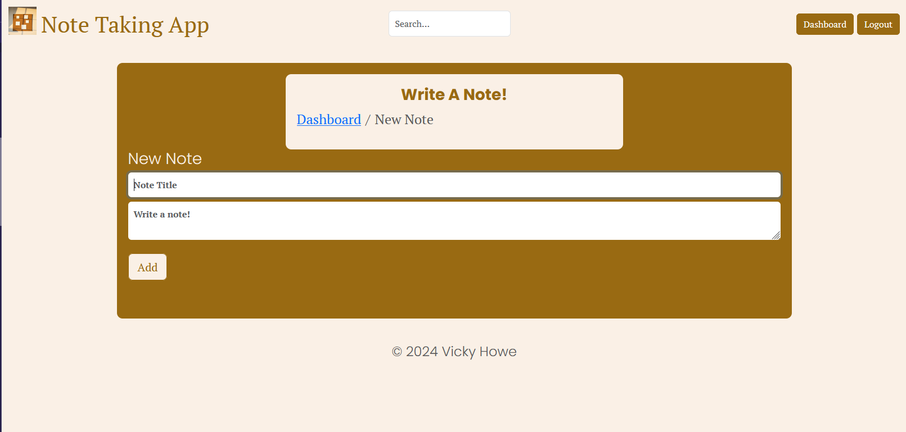
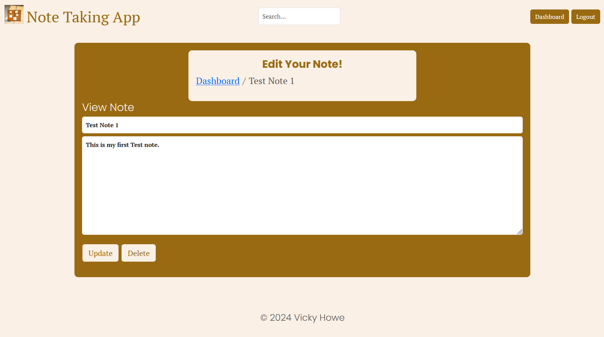
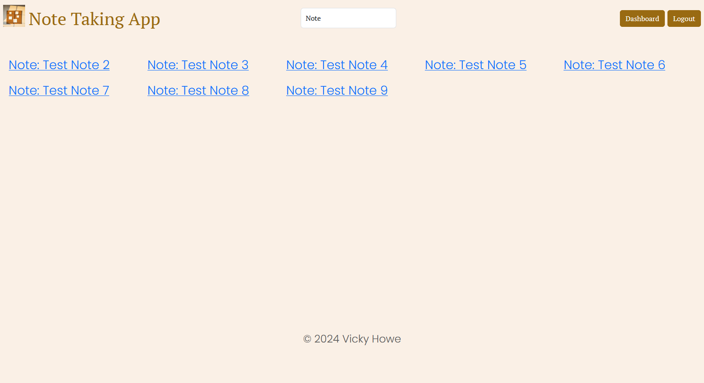

# Note-Taking-App
Sample of this app deployed at [https://note-taking-app-6duw.onrender.com](https://note-taking-app-6duw.onrender.com). Please note this is the free deployment version at this time so will need to be patient and refresh to "wake-up" the server. 

This is a simple web application that logins a user, stores a session to avoid repleat signing in and allows a user to create notes that can be:

+ created
+ modified
+ searched
+ deleted


This application utilizes;

+ node.js with Express to handle middlewares
+ A MongoDB local database to store data
+ CRUD Operations to handle User through RESTful API requests
+ Error Handling through custom middlewares
+ User Navigation through EJS with Bootstrap and CSS
+ A simple login system with Passport.js for authentication
+ API Route Definitions with Swagger


## User Interface:

### HomePage Screen


### Login Screen


### Register Screen


### Dashboard Screen
#### No notes present


#### Notes present


### Create Note Screen


### Edit Note Screen


### Search Note Result Screen


## To run this application

### Setup
1. Clone the repository
2. Install the required packages by running `npm install` in the project directory
```
npm install
```
3. Create a `.env ` file in the main project folder. 

+ for MONGODB_URI = mongodb://localhost:27017/yourdatabasehere
As we are using a local database no password is required. Relplace 'yourdatabasehere' with database name of choice.
+ Fill in a Port for the project to run

+ To get Google OAuth Credentials Refer to [OAuth client ID Credentials](https://developers.google.com/workspace/guides/create-credentials#oauth-client-id) and copy your GOOGLE_CLIENT_ID and GOOGLE_CLIENT_SECRET=. The 'GOOGLE_CALLBACK_URL=http://localhost:(PORTYOUCHOSE)/google/callback' Replace th port with the port you are using and should match the one set in Google when creating credientials.

+ SESSION_SECRET= Needs to be in string format you can use any value here.

```
MONGODB_URI = mongodb://localhost:27017/yourdatabasehere

PORT= REPLACE THIS WITH A PORT

GOOGLE_CLIENT_ID=
GOOGLE_CLIENT_SECRET=
GOOGLE_CALLBACK_URL=http://localhost:(PORTYOUCHOSE)/google/callback

SESSION_SECRET=' '

```
### Running the program
1. Run `npm start` in the project directory to start the server
```
npm start
```
2. Open a web browser and navigate to `http://localhost:(match port number you set)/` to access


### Referencing the API
The API is documented using Swagger. You can access the API documentation by navigating to `http://localhost:(Portyouchose)/api-info`

## References 
Throughout this project I referenced Blackbox ai to aid in troubleshoot issues when I got stuck.

1) Chat blackbox: Ai code generation, code chat, code search. Chat Blackbox: AI Code Generation, Code Chat, Code Search. (n.d.). https://www.blackbox.ai/ 

SettingTo setup MongoDB and passport strategies I referenced;

2) Jdesboeufs. (n.d.). Connect-Mongo/MIGRATION_V4.MD at 962C7DB8AFB14778EF6E3530F0ED9E4EDFF47CE9 · 
3) jdesboeufs/connect-mongo. GitHub. https://github.com/jdesboeufs/connect-mongo/blob/HEAD/MIGRATION_V4.md 

4) YouTube. (n.d.-b). https://youtu.be/F-sFp_AvHc8 

For the EJS layout and project flow I referenced;

5) YouTube. (n.d.-a). https://youtu.be/BDo1lgaZuII?si=Ji6YIwMcBCm6Rhtc 

My images are free public images from;

6) Free stock photos, royalty free stock images & Copyright Free Pictures · Pexels. (n.d.). https://www.pexels.com/ 


## Summary
<details>
  <summary>Things I learned</summary>
  <ul>
    <li>Express Route Handling</li>
    <li>How to restructure a project for scalability</li>
    <li>GitHub workflow</li>
    <li>How to use MongoDB</li>
    <li>How to link EJS pages for Web Scalability</li>
  </ul>
</details>

<details>
  <summary>Things I found difficult</summary>
  <ul>
    <li>Proper EJS linking and formatting</li>
    <li>Proper database data linking</li>
    <li>Search Bar for notes to properly search notes in database</li>
    <li>Project file structure and proper linking and order of project elements</li>
  </ul>
</details>

<details>
  <summary>Nice To Have Future Features</summary>
  <ul>
    <li>>Application Testing</li>
    <li>Categories for note sorting</li>
    <li>Custom colours for notes</li>\
    <li>Trash Bin to hold deleted notes until emptied</li>
  </ul>
</details>

